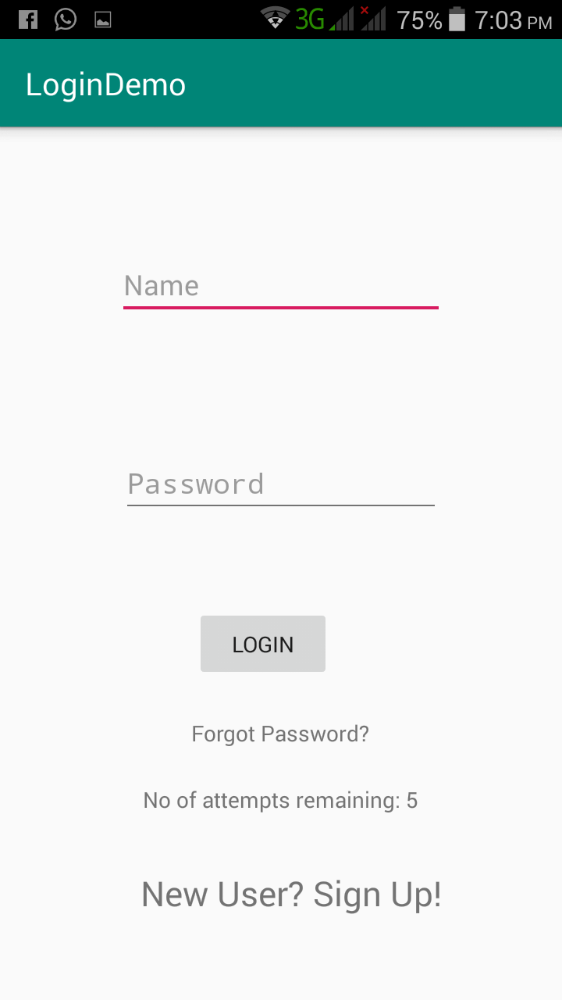
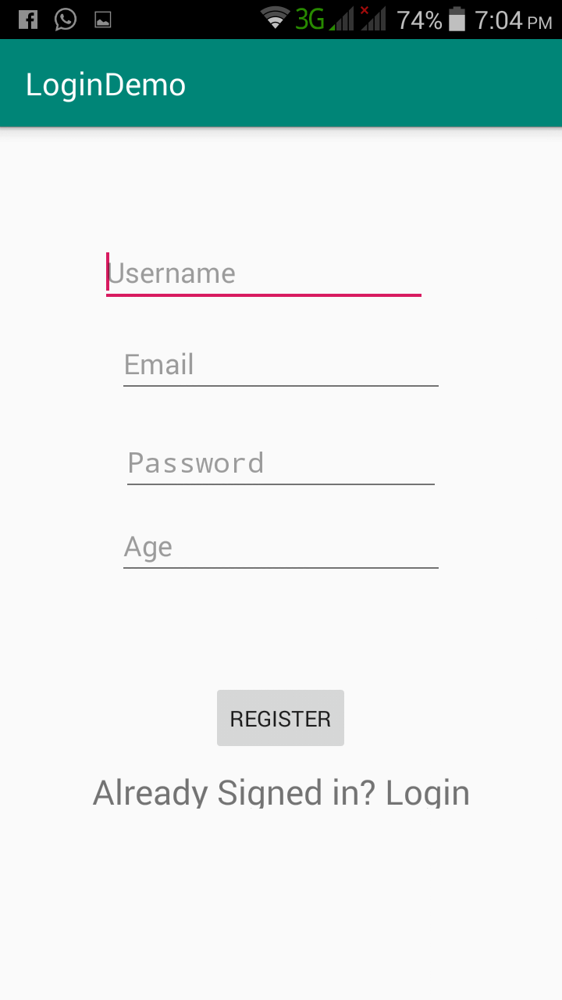
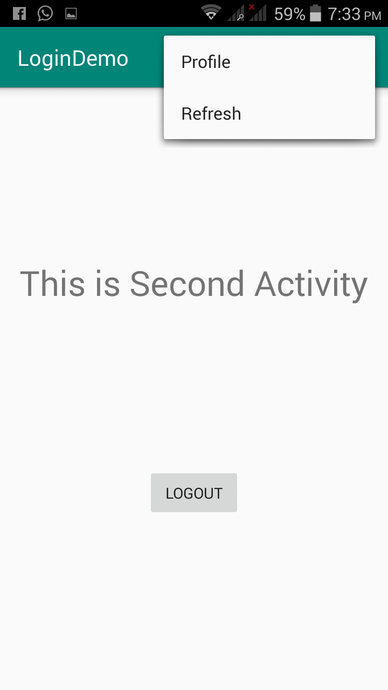
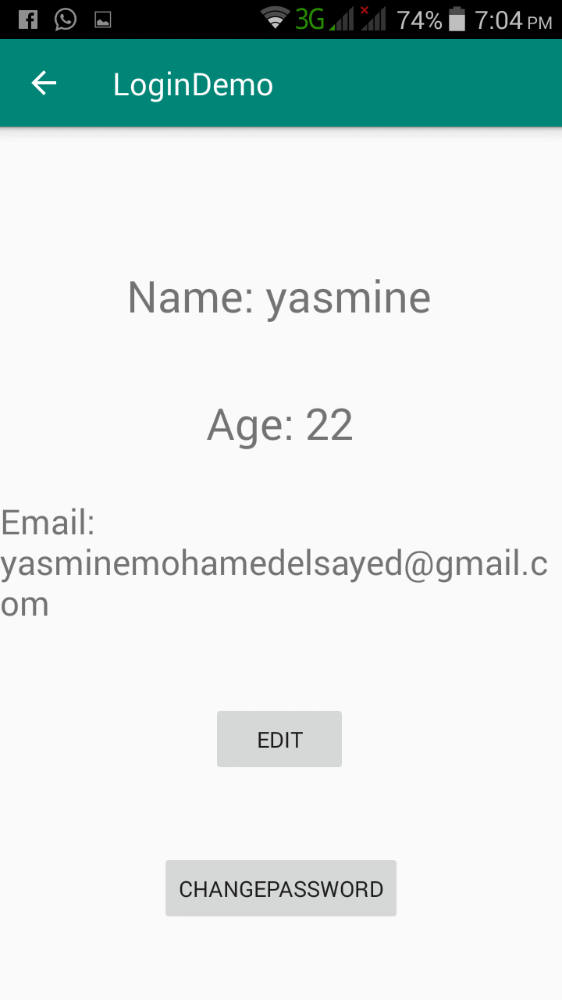
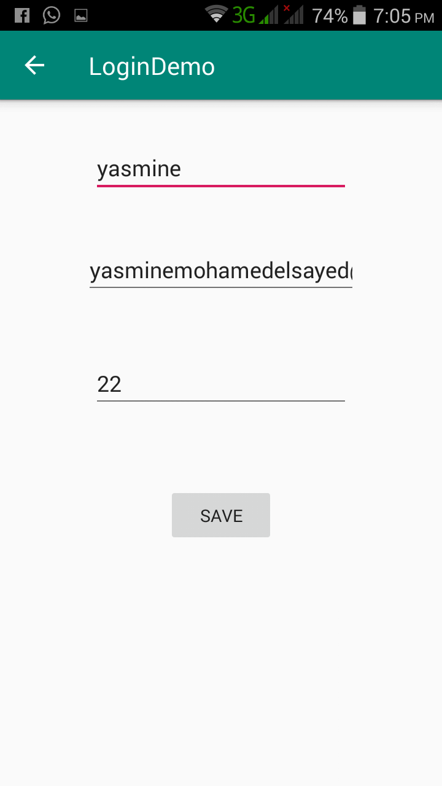

# LoginSystem

An app to login and signup and edit your profile.

# HOW TO RUN

## when you open the app.

## then you click on signup.

## when you click on login.

## then you click on profile.

## then you click on Edit.

# Implementation

the code divided to:

1-front end:

multiple xml files to for login and signup and edit profile.

2-back end:

i used firebase libraries in authentication and database .
